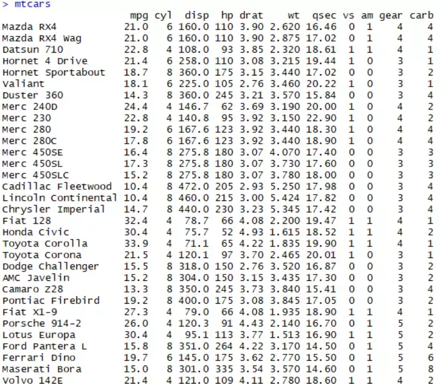

MTCARS data set analysis: MPG and type of transmission Evaluate the relationship between consumption of the engine, and type of transmission

The data was extracted from the 1974 Motor Trend US magazine, and comprises fuel consumption and 10 aspects of automobile design and performance for 32 automobiles (1973-1974 models).

### Usage

