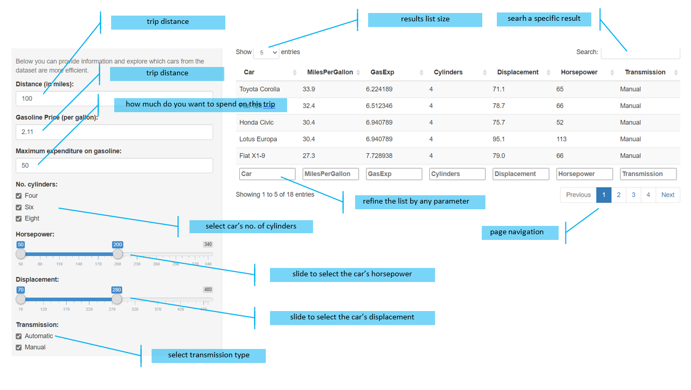

Coursera - Developing Data Products Course Project
========================================================
author: Rodrigo Morais
date: 11/12/2020
autosize: true

Shiny Application and Reproducible Pitch
========================================================
 
Application created based on the MTCARS data set analysis: MPG and type of transmission Evaluate the relationship between consumption of the engine, and type of transmission

- The data was extracted from the 1974 Motor Trend US magazine
- Comprises fuel consumption and 10 aspects of automobile design
- Includes performance for 32 automobiles (1973-1974 models)

Features
========================================================
 
The application include inputs and controls allowing to customize the information needed to extract from the database vehicle data

- **Traveled distance in miles:** desired distance to calculate car's efficiency
- **Fuel price:** price per gallon of gasoline/diesel
- **Maximum expenditure on gasoline:** maximum amount used in the trip
- **Numbers of cylinder in the car:** is the space in which a piston travels
- **Car horsepower:** indicate the power produced by a car's engine
- **Displacement:** measure of the cylinder volume swept by all of the pistons 
- **Transmission type:** automatic or manual transmission available

Application Interface
========================================================
 

More information
========================================================
 
- Github repository: https://github.com/RodMorais/Developing_Data_Products_Course_Project
- Coursera - Developing Data Products Course: https://www.coursera.org/learn/data-products/home/welcome
 
 
 

